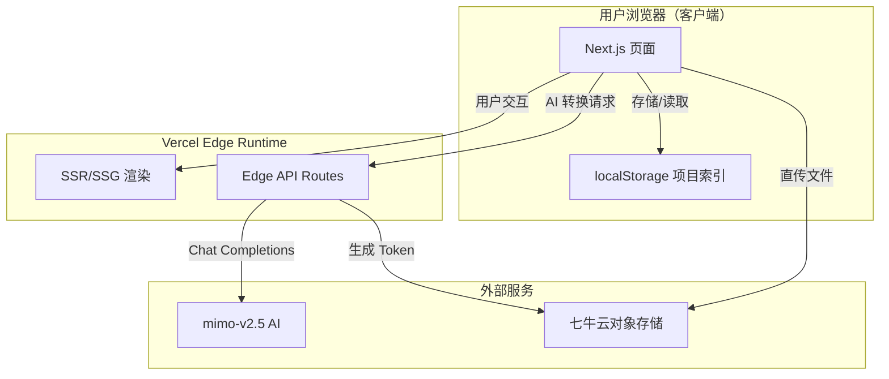
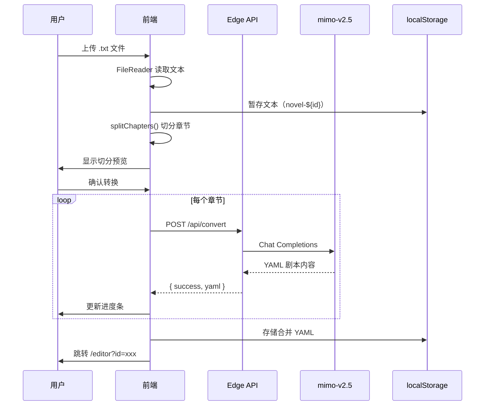

# 技术架构文档

## 1. 系统架构概览

### 1.1 架构图



### 1.2 组件关系图

```mermaid
graph LR
    subgraph "页面层"
        HOME[首页 /]
        CONVERT[转换页 /convert]
        EDITOR[编辑器 /editor]
    end

    subgraph "组件层"
        UPLOADER[FileUploader]
        SPLITTER[ChapterSplitter]
        AI[AI Convert]
        YMLEDIT[YamlEditor]
        YAMLVIEW[YamlPreview]
    end

    subgraph "服务层"
        API_CONVERT[/api/convert]
        API_TOKEN[/api/upload-token]
    end

    HOME --> UPLOADER
    CONVERT --> SPLITTER
    CONVERT --> AI
    EDITOR --> YMLEDIT
    EDITOR --> YAMLVIEW
    AI --> API_CONVERT
```

## 2. 数据流

### 2.1 核心业务流程



## 3. 技术栈

| 层级 | 技术 | 版本 | 说明 |
|------|------|------|------|
| 前端框架 | Next.js 14 (App Router) | 14.2 | 全栈一体 |
| 样式 | Tailwind CSS + shadcn/ui 风格 | 3.4 | 原子化 CSS |
| AI | mimo-v2.5 | - | 七牛云指定模型 |
| 存储 | 七牛云对象存储 | - | 大文件托管 |
| 部署 | Vercel Hobby | - | 零成本 Edge Runtime |
| 测试 | Vitest + Playwright | 2.1 / 1.48 | 全链路覆盖 |

## 4. API 端点

| 路径 | 方法 | Runtime | 说明 |
|------|------|---------|------|
| `/api/convert` | POST | Edge | AI 转换（单章节） |
| `/api/upload-token` | POST | Edge | 七牛云上传 Token |
| `/api/download/[key]` | GET | Edge | 七牛云签名下载 |

## 5. 安全设计

| 措施 | 实现 |
|------|------|
| API Key 服务端隔离 | 仅在 Edge API Route 读取 `process.env` |
| 上传 Token 短期有效 | 1 小时过期 |
| 文件大小限制 | 前端 10MB + 后端校验 |
| AI 并发限制 | 最大 3 个并发请求 |
| 单请求超时 | AbortController 30s |

## 6. 技术选型理由

| 决策 | 选择 | 理由 |
|------|------|------|
| 框架 | Next.js 14 | 全栈一体 + Edge Runtime + App Router |
| 样式 | Tailwind CSS | 快速开发 + 一致性 + 小体积 |
| Schema 校验 | Zod | TypeScript 原生 + 前后端共享 |
| 无数据库 | localStorage + 七牛云 | MVP 零成本、无服务端状态 |
