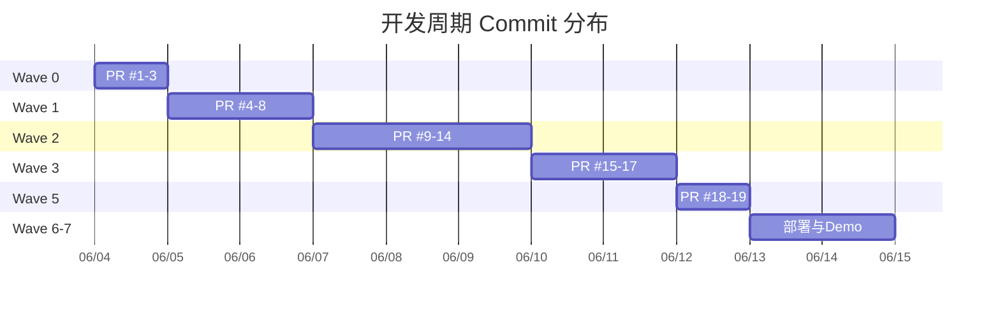

# GitHub PR 提交清单

## 概览

- **总计 PR 数**：15 个（最低要求 ≥15）
- **合并策略**：Squash Merge + 删除源分支
- **分支命名**：`feat/xxx` / `fix/xxx` / `docs/xxx` / `test/xxx` / `chore/xxx`
- **PR 规范**：一个 PR 只做一件事

## PR 列表

### Wave 0 — 环境准备

| # | PR 标题 | 分支 | 功能描述 | 文件 |
|---|--------|------|---------|------|
| 1 | chore: 项目初始化与 .gitignore | `chore/init` | 初始化 Git 仓库，配置 .gitignore | `.gitignore` |
| 2 | feat(poc): mimo API PoC 验证 | `feat/poc` | 验证 mimo-v2.5 YAML 输出质量和性能 | `poc/` |
| 3 | feat(samples): 添加测试小说样本 | `feat/samples` | 准备 3 个标准测试样本 | `poc/samples/` |

### Wave 1 — 项目骨架

| # | PR 标题 | 分支 | 功能描述 | 文件 |
|---|--------|------|---------|------|
| 4 | feat(init): Next.js 14 项目初始化 | `feat/init` | package.json, tsconfig, Tailwind, 依赖安装 | `package.json`, `tsconfig.json` |
| 5 | feat(schema): YAML Schema 定义 | `feat/schema` | JSON Schema + Zod 双格式 | `src/schema/`, `docs/05-yaml-schema.md` |
| 6 | feat(ui): 基础 UI Layout 与组件 | `feat/ui-layout` | Button/Card/Input, Header/Footer, 页面 | `src/components/`, `src/app/` |
| 7 | feat(validator): Zod Schema 校验工具 | `feat/validator` | yaml-validator + 8 单元测试 | `src/lib/utils/yaml-validator.ts` |
| 8 | chore(ci): PR 模板 + CI + Commit 规范 | `chore/ci` | PR template, CI workflow, CODEOWNERS | `.github/` |

### Wave 2 — 核心功能

| # | PR 标题 | 分支 | 功能描述 | 文件 |
|---|--------|------|---------|------|
| 9 | feat(upload): 文件上传组件 | `feat/upload` | 拖拽上传 + TXT/MD + 10MB 限制 | `src/components/upload/` |
| 10 | feat(splitter): 章节切分逻辑 | `feat/splitter` | 正则切分 + 用户预览 | `src/lib/utils/chapter-splitter.ts` |
| 11 | feat(ai): mimo AI Edge Runtime 集成 | `feat/ai` | Prompt + 调用 + 重试 + 并发控制 | `src/lib/ai/`, `src/app/api/convert/` |
| 12 | feat(editor): YAML 编辑器 + 实时校验 | `feat/editor` | 双栏编辑/预览 + Zod 校验 + 自动保存 | `src/components/editor/` |
| 13 | feat(storage): localStorage 项目管理 | `feat/storage` | 项目 CRUD + 文本/YAML 暂存 | `src/lib/utils/storage.ts` |
| 14 | feat(export): YAML/JSON 导出 | `feat/export` | 多格式下载 | `src/app/editor/page.tsx` |

### Wave 3 — 七牛云 + 测试

| # | PR 标题 | 分支 | 功能描述 | 文件 |
|---|--------|------|---------|------|
| 15 | feat(qiniu): 七牛云上传/下载集成 | `feat/qiniu` | Token + 直传 + 签名下载 | `src/lib/qiniu/` |
| 16 | test(unit): 单元测试覆盖率 ≥60% | `test/unit` | 补充至 ≥30 个测试 | `__tests__/` |
| 17 | test(e2e): Playwright E2E 测试 | `test/e2e` | ≥5 个场景覆盖主流程 | `tests/e2e/` |

### Wave 5 — 文档

| # | PR 标题 | 分支 | 功能描述 | 文件 |
|---|--------|------|---------|------|
| 18 | docs(readme): README 文档 | `docs/readme` | 完整 README + 依赖列表 + 原创说明 | `README.md` |
| 19 | docs(arch): 技术架构文档 | `docs/arch` | Mermaid 架构图 + API 文档 | `docs/02-architecture.md` |

## Commit 分布要求

> ⚠️ **作业评分要求**：所有 commit 时间戳必须均匀分布，严禁突击提交。



## PR 提交模板

每个 PR 必须包含以下 4 个 section：

```markdown
## 功能描述
[一句话说明本 PR 做了什么]

## 实现思路
[技术方案概述，关键代码逻辑]

## 测试方式
[如何验证此功能正确工作]

## 关联 Issue
[如有，填写 #issue-number]
```
